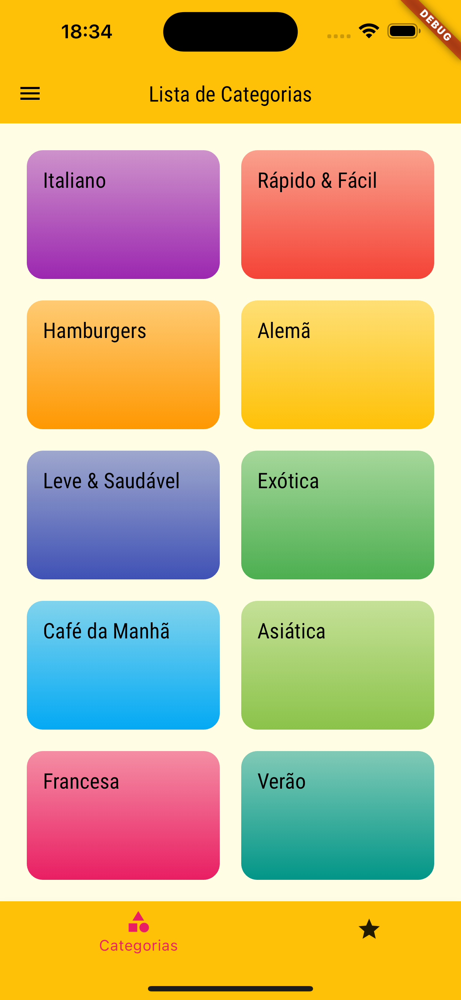
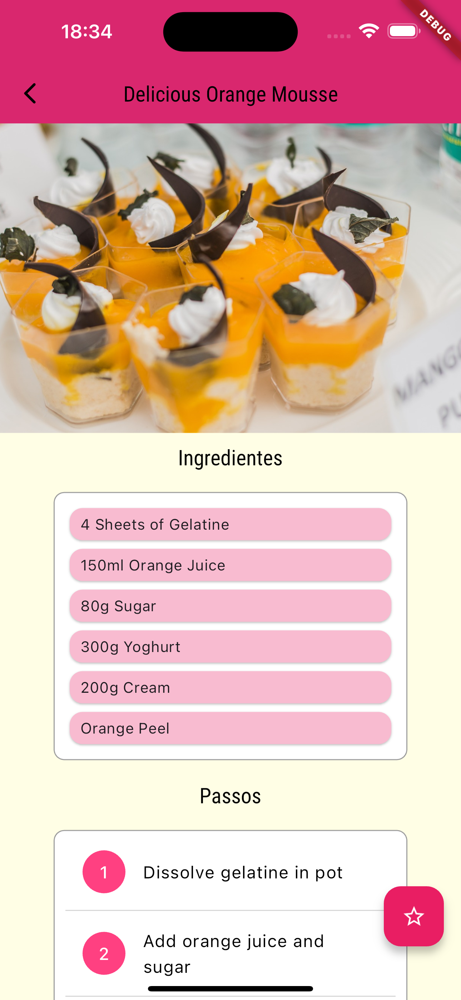
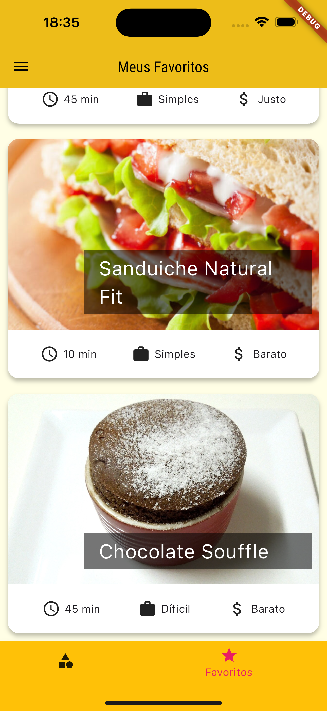

# recipes_app
Este é um aplicativo no qual seu intuito é mostrar receitas de diferentes categorias.

### O que eu aprendi neste aplicativo
Criação de novas telas, criação de novas rotas para telas, Stack de telas com rotas nomeadas, apresentação de imagens a partir de URLs com image.network, como usar Stack para colocar widgets em cima um do outro, voltar a página inicial caso a rota não seja identificada, ListTile, Divider para criar uma linha de divisória simples, TabBar, BottonNavigationBar, Drawer e como fazer filtragem de itens de uma lista. 

### Layout
  

#### GIFS
   

## Fundamentos de flutter

- [x] Stack de telas
- [x] Rotas nomeadas
- [x] ListTile
- [x] TabBar
- [x] BottonNavigatorBar
- [x] Drawer
- [x] Filtro de Itens

### Tecnologias utilizadas
- ``VSCode``
- ``Dart``
- ``Flutter``
- ``XCode = Emulador de IOs``
- ``Android Studio = Emulador Android``
- ``iPad = Emulador iPadOS``

 

